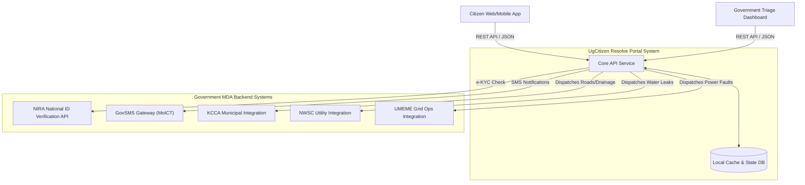

# Agency API Specifications & Integrations: UgCitizen Resolve Portal

This document serves as the **Internal Derivative Specification** for the UgCitizen Resolve Portal. It models the core application APIs for both the citizen-facing portal and the administrative triage dashboard, alongside direct integrations with external **Ugandan Government MDA** systems.

The API documentation below is modeled after modern interactive design specifications (similar to **Swagger** and **Stoplight**), tailored specifically for Ugandan Government Systems.

---

## 1. System Integration Architecture

The UgCitizen Resolve Portal consists of a **Citizen Portal** frontend, a secure **Government Triage Dashboard** backend, and integration adapters that communicate with key Ministry, Department, and Agency (MDA) systems directly.



---

## 2. Core Application APIs (Citizen & Triage Admin)

*   **Base URL**: `http://localhost:3000/api/v1`
*   **Authentication**: None (for Citizen submission & tracking) / Cookie-based JWT (for Government Triage Dashboard)

---

### 2.1. Citizen Portal APIs

#### `POST /reports`
Allows citizens to submit a local issue by uploading photographic evidence, dropping a geographic pin, and selecting the issue category. Returns a tracking number and initial status `"Received"`.

##### Request Body (multipart/form-data or application/json)
| Field Name | Type | Required | Description |
| :--- | :--- | :--- | :--- |
| `citizen_nin` | `string` | Yes | 14-character Ugandan National ID number (for identity check). |
| `category` | `string` | Yes | Must be one of: `BROKEN_INFRASTRUCTURE`, `WATER_LEAK`, `PUBLIC_SERVICE_FAILURE`. |
| `description` | `string` | Yes | Text description explaining the issue. |
| `latitude` | `number` | Yes | Latitude of the dropped geographic pin. |
| `longitude` | `number` | Yes | Longitude of the dropped geographic pin. |
| `street_address` | `string` | Yes | Descriptive address or landmark name (e.g., "Wandegeya, near the roundabout"). |
| `photo` | `string` | Yes | Base64-encoded image string or image file payload. |

###### Request Body Example
```json
{
  "citizen_nin": "CM98012345XYZD",
  "category": "WATER_LEAK",
  "description": "A major pipe burst near the main road, causing water to flood the street.",
  "latitude": 0.329400,
  "longitude": 32.571400,
  "street_address": "Wandegeya Market Road, Kampala",
  "photo": "data:image/jpeg;base64,/9j/4AAQSkZJRgABAQEASABIAAD..."
}
```

##### Responses

###### `201 Created`
Returned when the report is successfully created and registered with the system.
```json
{
  "tracking_number": "UG-CIT-2026-90234",
  "status": "Received",
  "category": "WATER_LEAK",
  "latitude": 0.329400,
  "longitude": 32.571400,
  "created_at": "2026-05-20T14:38:00Z"
}
```

---

#### `GET /reports/{trackingNumber}`
Allows citizens to monitor the status of their report in real-time.

##### Responses

###### `200 OK`
```json
{
  "tracking_number": "UG-CIT-2026-90234",
  "category": "WATER_LEAK",
  "description": "A major pipe burst near the main road, causing water to flood the street.",
  "latitude": 0.329400,
  "longitude": 32.571400,
  "street_address": "Wandegeya Market Road, Kampala",
  "status": "In Progress",
  "assigned_team": "NWSC Wandegeya Maintenance Crew B",
  "created_at": "2026-05-20T14:38:00Z",
  "updated_at": "2026-05-20T15:05:00Z",
  "history": [
    {
      "status": "Received",
      "timestamp": "2026-05-20T14:38:00Z",
      "remarks": "Report submitted by citizen and queued for triage."
    },
    {
      "status": "In Progress",
      "timestamp": "2026-05-20T15:05:00Z",
      "remarks": "Assigned to NWSC maintenance crew. Team has been dispatched."
    }
  ]
}
```

---

### 2.2. Government Triage Dashboard APIs (Secure)

#### `GET /admin/reports`
Retrieves all reported issues, including categories, photos, and geo-coordinates for rendering on the dashboard map view.

##### Query Parameters
| Parameter | Type | Required | Description |
| :--- | :--- | :--- | :--- |
| `status` | `string` | No | Filter by status: `Received`, `In Progress`, or `Resolved`. |

##### Responses

###### `200 OK`
```json
[
  {
    "tracking_number": "UG-CIT-2026-90234",
    "category": "WATER_LEAK",
    "description": "A major pipe burst near the main road, causing water to flood the street.",
    "latitude": 0.329400,
    "longitude": 32.571400,
    "street_address": "Wandegeya Market Road, Kampala",
    "status": "Received",
    "assigned_team": null,
    "created_at": "2026-05-20T14:38:00Z"
  }
]
```

---

#### `POST /admin/reports/{trackingNumber}/assign`
Assigns the reported issue to a local response team (e.g. KCCA Central Roads Division, NWSC Wandegeya Team, or UMEME emergency crew). This action moves the report status from `"Received"` to `"In Progress"`.

##### Request Body (application/json)
| Field Name | Type | Required | Description |
| :--- | :--- | :--- | :--- |
| `assigned_team` | `string` | Yes | Name of the local response team or agency division responsible. |

###### Request Body Example
```json
{
  "assigned_team": "NWSC Wandegeya Maintenance Crew B"
}
```

##### Responses

###### `200 OK`
```json
{
  "tracking_number": "UG-CIT-2026-90234",
  "status": "In Progress",
  "assigned_team": "NWSC Wandegeya Maintenance Crew B",
  "updated_at": "2026-05-20T15:05:00Z"
}
```

---

#### `POST /admin/reports/{trackingNumber}/resolve`
Submits resolution details, marks the issue as `"Resolved"`, and triggers notification dispatch back to the citizen.

##### Request Body (application/json)
| Field Name | Type | Required | Description |
| :--- | :--- | :--- | :--- |
| `resolution_remarks` | `string` | Yes | Details of the resolution (e.g. what was repaired, who verified it). |

###### Request Body Example
```json
{
  "resolution_remarks": "The burst main pipe has been welded and reinforced. Water pressure was restored and the road area was cleaned up."
}
```

##### Responses

###### `200 OK`
```json
{
  "tracking_number": "UG-CIT-2026-90234",
  "status": "Resolved",
  "resolution_remarks": "The burst main pipe has been welded and reinforced. Water pressure was restored and the road area was cleaned up.",
  "updated_at": "2026-05-20T16:15:00Z"
}
```

---

## 3. Background Integration APIs (Direct MDA Systems)

These endpoints are mock specifications representing backend systems synchronized by integration adapters during the life-cycle of a report.

### 3.1. NIRA Verification (`POST http://localhost:3000/api/nira/v1/verify`)
Checks validity of `citizen_nin` against NIRA registries when a citizen submits a complaint.
*   **Request**: `{"nin": "CM98012345XYZD"}`
*   **Response**: `200 OK` with verified demographic details, or `404 Not Found`.

### 3.2. GovSMS Gateway (`POST http://localhost:3000/api/sms/v1/send`)
Sends notifications back to the citizen's phone number as the status transitions.
*   **Request**: `{"phone": "256772123456", "message": "Ndugu, your report UG-CIT-2026-90234 has been resolved: [remarks]. Web: citizen-resolve.go.ug"}`
*   **Response**: `200 OK` with SMS reference status.
