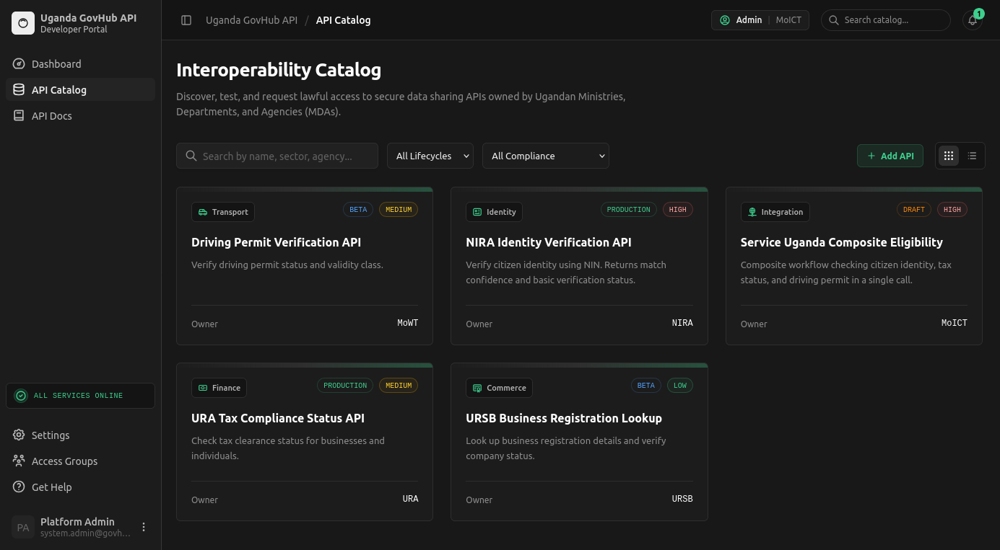
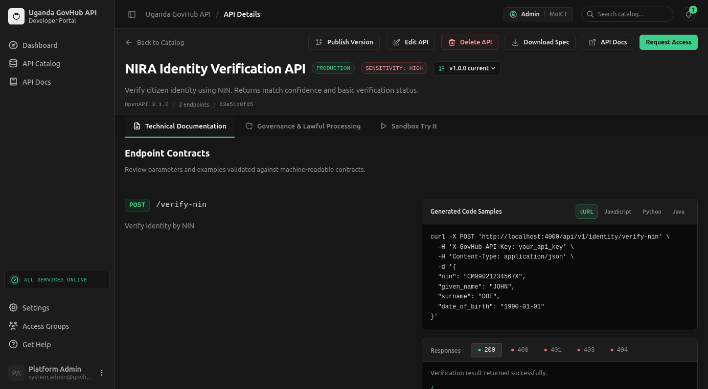
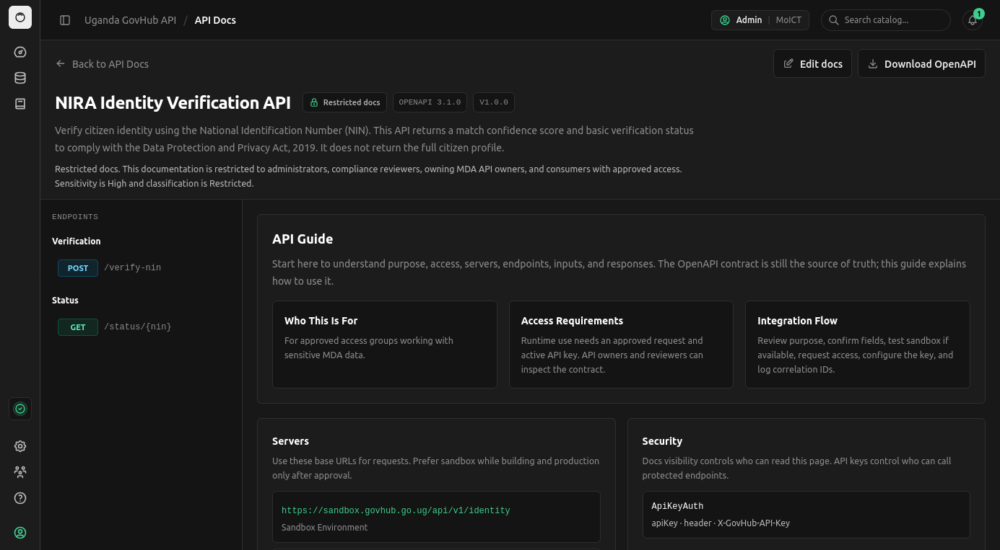
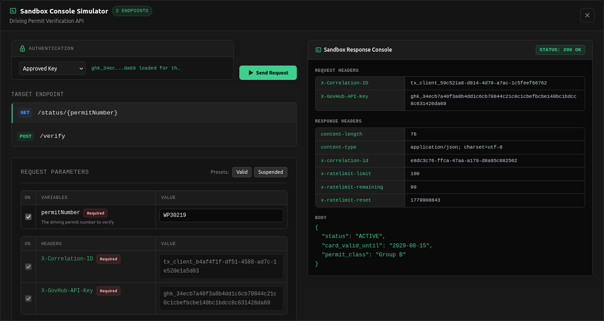
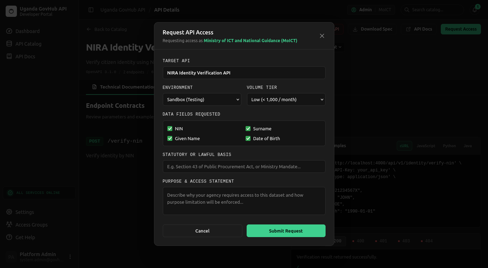
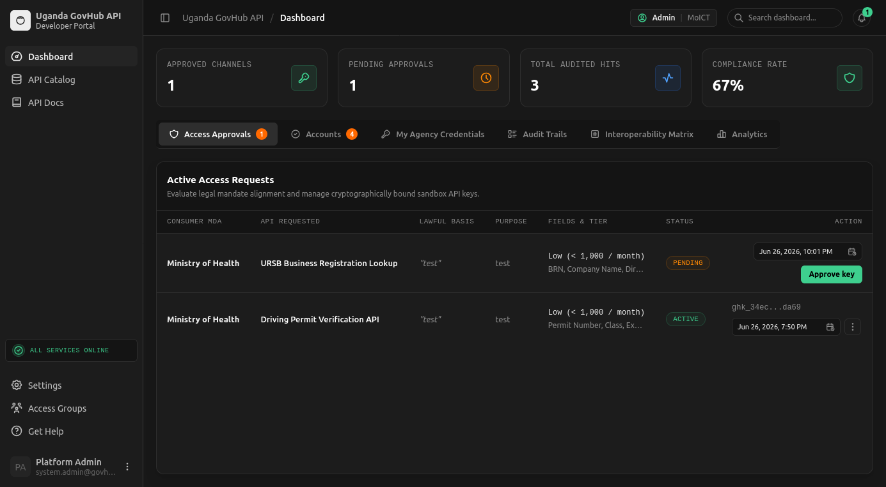
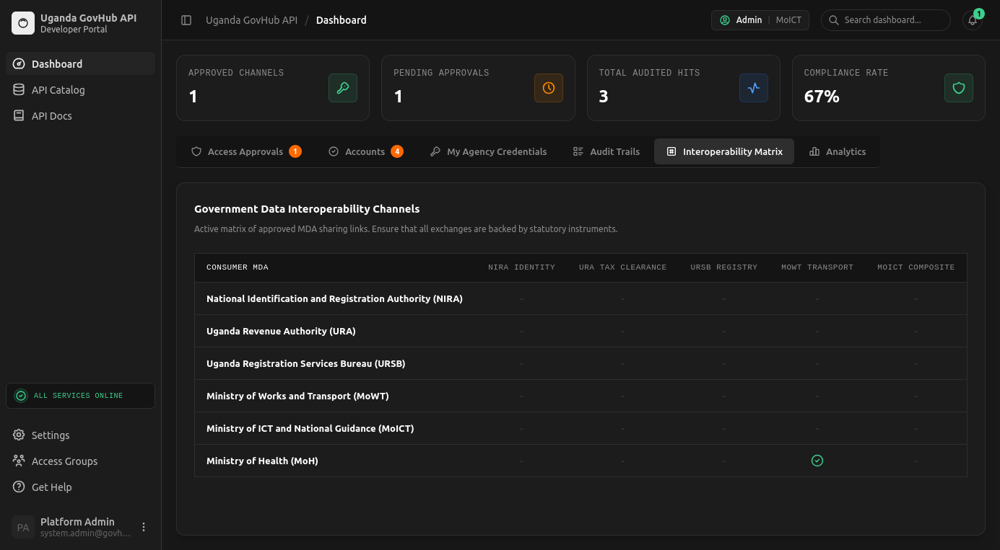
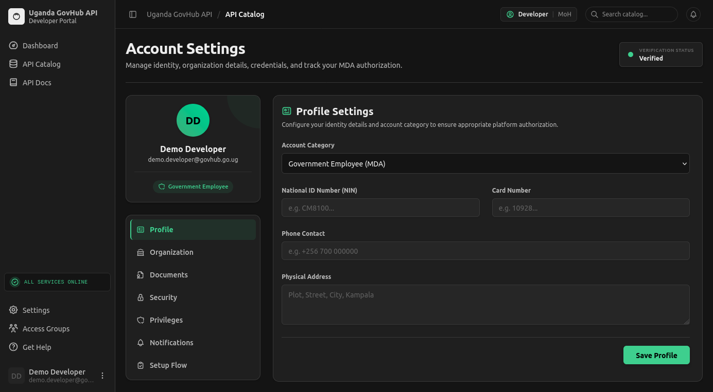
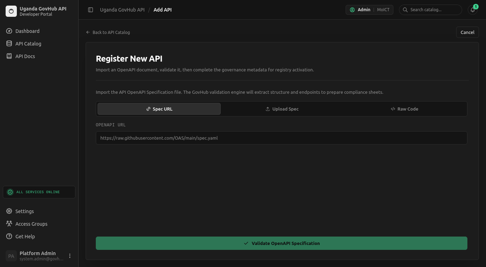
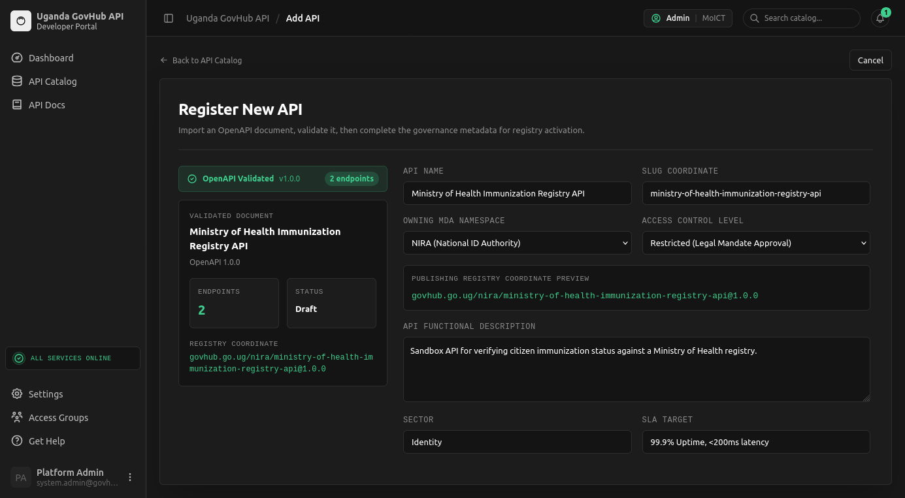

# Uganda GovHub API: Interoperability and Data Exchange

<p align="center">
  
  <br />
  <strong>Uganda GovHub API</strong><br />
  Closed-source government interoperability prototype
</p>

<p align="center">
  <a href="../README.md">Main Repo</a>
  ·
  <a href="LICENSE">License</a>
  ·
  <a href="COPYRIGHT.md">Copyright</a>
  ·
  <a href="CODE_OF_CONDUCT.md">Code of Conduct</a>
  ·
  <a href="../CONTRIBUTING.md">Contributing</a>
  ·
  <a href="../SECURITY.md">Security</a>
</p>

<p align="center">
  
  
  
  
</p>

## Repository Access Notice

This repository is **closed-source proprietary intellectual property**. It is
made available only to explicitly authorized collaborators or reviewers.
Cloning, downloading, or viewing this repository does not grant any right to
copy, redistribute, deploy, publish, modify, commercialize, train AI models on,
or reuse any part of the source code, documentation, designs, API
specifications, assets, or related materials.

Access for government, institutional, procurement, security, or technical review
is for evaluation only unless a separate signed written agreement grants broader
rights.

Uganda copyright law protects original works reduced to material form, including
computer programmes, electronic data banks, and accompanying materials. The
license and notices in this repository are written to preserve those rights and
to make clear that review access does not transfer ownership or grant production
use.

Repository governance documents:

- [Proprietary source-available license](LICENSE)
- [Copyright and intellectual property notice](COPYRIGHT.md)
- [Code of conduct](CODE_OF_CONDUCT.md)
- [Main repository contributing rules](../CONTRIBUTING.md)
- [Main repository security policy](../SECURITY.md)

## Thematic Area

**Area 10: Interoperability and Data Exchange** - government API platforms, data integration middleware, and governed MDA data exchange.

## Purpose

Uganda GovHub API is a working prototype for a government API developer portal and sandbox. It demonstrates how Ministries, Departments, and Agencies can discover APIs, review governance metadata, request access, test integrations with mock data, and audit data-sharing activity from one place.

The prototype is designed for the Ministry of ICT and National Guidance innovator showcase. It is not connected to live NIRA, URA, URSB, NITA-U, or other production government systems.

## Problem

Many government systems still operate as isolated silos. A ministry or agency often has to verify identity, tax, business, permit, or service eligibility information through manual requests or fragmented channels. That slows service delivery, increases duplication, and weakens traceability.

## Solution

GovHub API models a secure interoperability layer around government APIs:

- A searchable API catalog for MDA-owned services.
- Custom OpenAPI documentation pages for each registered API.
- Sandbox endpoints with deterministic mock responses and structured errors.
- Access request and approval workflows for governed data sharing.
- Scoped sandbox API keys with expiry, revocation, and audit trails.
- Dashboard views for approvals, accounts, access matrix, analytics, and audit logs.
- API registration and OpenAPI validation for onboarding new ministry services.

## Platform Screenshots

### API Catalog



The catalog lets users discover government API products by agency, sector, lifecycle, compliance status, and sensitivity level.

### API Details



API detail pages show service ownership, sensitivity, access requirements, endpoint summaries, examples, and code samples.

### API Documentation



Custom documentation pages expose OpenAPI-backed schemas, request bodies, response models, security requirements, and access notes.

### Sandbox Execution



The sandbox console demonstrates scoped API-key use, request parameters, response headers, rate-limit metadata, and correlation IDs with deterministic mock data.

### Access Request



The access request flow captures purpose, statutory basis, environment, data fields, and expected request volume before review.

### Governed Access Review



The dashboard shows pending and active access requests, including consumer MDA, requested API, lawful basis, field tier, status, expiry, and approval actions.

### Interoperability Matrix



The matrix summarizes which agencies can consume which services and where approval, compliance, or review gaps remain.

### Account Settings



Account settings centralize profile, organization, document, security, privilege, notification, and setup-flow information.

### API Registration Import



The first registration screen supports OpenAPI URL, file upload, and raw specification entry before validation.

### API Registration Metadata



The second registration screen collects ownership, namespace, access control, sector, SLA, and governance metadata before catalog activation.

## Current Implementation

The app is implemented as a local full-stack prototype:

- **Frontend:** React, TypeScript, Vite, React Router, and GovHub-specific UI components.
- **Backend:** Node.js, Express, TypeScript, PostgreSQL via `pg`.
- **API contracts:** OpenAPI specs stored in Postgres and served through `/openapi/*.yaml`.
- **Auth:** Cookie-backed sessions with seeded demo accounts.
- **Security controls:** MFA setup and enforcement, role-based access control, sensitive field encryption at rest, TLS/HSTS support, audit logging, and privacy metadata aligned to Uganda's Data Protection and Privacy Act, 2019.
- **Integrations:** Mock/sandbox services for NIRA-style identity verification, URA-style tax status, URSB-style business lookup, driving permit verification, and composite eligibility checks. There are no live external integrations.

## Local Demo

Install dependencies:

```bash
npm run install:all
```

Create local env files from the examples if they do not already exist:

```bash
cp .env.example .env
cp backend/.env.example backend/.env
cp frontend/.env.example frontend/.env
```

The backend is Postgres-only. For local testing, the example env uses:

```bash
DATABASE_URL=postgresql://<user>:<password>@localhost:5432/<database>
DATABASE_SSL=false
```

Set local `.env` values before running the demo. The checked-in `.env.example` files intentionally use placeholders and public test keys rather than reusable passwords.

Start the local demo:

```bash
npm run dev
```

For local development, `npm run dev` tries to start Docker if it is not already running, starts the Postgres container, waits for Postgres to accept connections, seeds the database, and then starts the frontend and backend. This is local demo behavior only; production startup remains covered in the deployment section below. `npm run db:up` starts a `postgres:16-alpine` container named `uganda-govhub-postgres` on local port `5432`. The script uses Docker's default connection first, then common user/rootless Docker startup paths; if your Docker daemon uses a non-standard socket, set `DOCKER_HOST` before running the script.

The frontend runs on the Vite dev-server URL shown in the terminal. The backend defaults to `http://127.0.0.1:4000`.

For e2e-style local startup with explicit host and port values:

```bash
npm run dev:e2e
```

Useful scripts:

```bash
npm run db:up
npm run db:down
npm run db:logs
npm run lint
npm run build
npm test
```

## Full Vercel Deployment

The app can deploy as one Vercel project:

- Vercel builds the Vite frontend from `frontend/`.
- Vercel routes `/api/*` and `/openapi/*` to the Express API function.
- Vercel routes all other paths to the React Router SPA fallback.
- Postgres is the persistent store for app data and OpenAPI spec text.

Core Vercel environment variables:

```bash
DATABASE_URL=postgresql://...
GOVHUB_TRUST_TLS_TERMINATION=true
GOVHUB_ALLOWED_ORIGINS=https://your-app.vercel.app,https://your-custom-domain.com
GOVHUB_ADMIN_EMAIL=admin@ict.go.ug
GOVHUB_ADMIN_PASSWORD=...
GOVHUB_DEMO_MODE=true
GOVHUB_DATA_ENCRYPTION_KEY=...
GOVHUB_REQUIRE_ADMIN_MFA=true
GOVHUB_TURNSTILE_SECRET_KEY=...
GOVHUB_TURNSTILE_ALLOWED_HOSTNAMES=your-app.vercel.app,your-custom-domain.com
```

`VITE_API_BASE_URL` can be omitted on Vercel when same-origin routing is used.

## Vercel/Postgres Notes

Use a hosted Postgres database for deployed environments. Set one of these variables in Vercel:

```bash
DATABASE_URL=postgresql://...
```

Vercel Postgres-style variables are also supported:

```bash
POSTGRES_URL=postgresql://...
POSTGRES_PRISMA_URL=postgresql://...
```

Do not set `DATABASE_SSL=false` in Vercel. The backend defaults to SSL for hosted Postgres connections.

## Demo Accounts

`GOVHUB_DEMO_MODE` is the single switch for demo users:

- `GOVHUB_DEMO_MODE=false` means no demo users are seeded. Use the configured
  admin account and normal sign-up/approval flows.
- `GOVHUB_DEMO_MODE=true` outside production seeds local demo users with the
  fallback credentials below.
- `GOVHUB_DEMO_MODE=true` in production seeds demo users, but never uses
  fallback passwords. Production still requires `GOVHUB_ADMIN_PASSWORD`,
  `GOVHUB_DATA_ENCRYPTION_KEY`, `GOVHUB_REQUIRE_ADMIN_MFA=true`, Turnstile, and
  normal HTTPS/origin configuration.

For a Vercel presentation deployment, keep `GOVHUB_DEMO_MODE=true` and configure
explicit passwords for the primary demo accounts:

```bash
GOVHUB_DEMO_DEVELOPER_EMAIL=demo.developer@govhub.go.ug
GOVHUB_DEMO_DEVELOPER_PASSWORD=...
GOVHUB_DEMO_API_OWNER_EMAIL=demo.api.owner@nira.go.ug
GOVHUB_DEMO_API_OWNER_PASSWORD=...
GOVHUB_DEMO_REVIEWER_EMAIL=demo.reviewer@govhub.go.ug
GOVHUB_DEMO_REVIEWER_PASSWORD=...
```

Those three passwords are required when `NODE_ENV=production` and
`GOVHUB_DEMO_MODE=true`, because they cover the main demo flows. Existing demo
users with the same email are updated on startup so the configured credentials
work after redeploy.

Optional demo account variables use the same pattern:

```bash
GOVHUB_DEMO_PUBLIC_DEVELOPER_EMAIL=demo.public.developer@example.com
GOVHUB_DEMO_PUBLIC_DEVELOPER_PASSWORD=...
GOVHUB_DEMO_PRIVATE_COMPANY_EMAIL=demo.company@example.com
GOVHUB_DEMO_PRIVATE_COMPANY_PASSWORD=...
GOVHUB_DEMO_BUSINESS_EMAIL=demo.business@example.com
GOVHUB_DEMO_BUSINESS_PASSWORD=...
GOVHUB_DEMO_RESEARCH_EMAIL=demo.research@example.edu
GOVHUB_DEMO_RESEARCH_PASSWORD=...
```

Optional demo accounts are skipped in production unless their password variable
is set. In local demo mode, these fallback credentials are available:

| Role | Local email | Local fallback password |
| --- | --- | --- |
| Platform admin | `admin@ict.go.ug` unless `GOVHUB_ADMIN_EMAIL` is set | Generated at startup unless `GOVHUB_ADMIN_PASSWORD` is set |
| MDA developer | `demo.developer@govhub.go.ug` | `DemoDeveloper123!` |
| NIRA API owner | `demo.api.owner@nira.go.ug` | `DemoApiOwner123!` |
| Compliance reviewer | `demo.reviewer@govhub.go.ug` | `DemoReviewer123!` |

## Key Routes

| Route | Purpose |
| --- | --- |
| `/` | API catalog and API detail workflow |
| `/docs` | Visible OpenAPI documentation index |
| `/docs/:apiId` | Per-API technical documentation |
| `/catalog/add` | Admin/API-owner API registration flow |
| `/dashboard` | Approvals, accounts, access matrix, audit trails, and analytics |
| `/settings` | Account profile, MFA, verification, and access group information |

## Security Configuration

Set `GOVHUB_DATA_ENCRYPTION_KEY` to a strong 32-byte base64 value or passphrase before using persistent data.

For HTTPS directly from the backend, set:

```bash
GOVHUB_TLS_CERT_PATH=/path/to/cert.pem
GOVHUB_TLS_KEY_PATH=/path/to/key.pem
```

If TLS is terminated by a reverse proxy or hosting platform, set:

```bash
GOVHUB_TRUST_TLS_TERMINATION=true
```

That lets the backend emit HSTS headers while still running behind external TLS termination.

## Presenter Path

1. Log in as the MDA developer and search the catalog for identity, tax, business, permit, or composite services.
2. Open an API detail page, review governance metadata, and submit a sandbox access request.
3. Log in as the platform admin or NIRA API owner and approve the request from the dashboard.
4. Return to the API detail page and run a sandbox request with the approved key.
5. Open the dashboard access matrix, audit logs, and analytics to show oversight and traceability.
6. Register a draft API from an OpenAPI specification to show the onboarding workflow.

## Form Positioning

For innovation-showcase forms:

- **RESTful API:** Yes. The backend exposes REST endpoints.
- **GraphQL API:** No.
- **NIRA / National ID:** Demonstrated through mock identity verification APIs, not a live NIRA integration.
- **URA systems:** Demonstrated through mock tax compliance APIs, not a live URA integration.
- **NITA-U infrastructure:** The prototype is positioned as complementary to national interoperability infrastructure, but it is not connected to live NITA-U infrastructure.
- **No external integrations currently:** Yes for live production systems. The current integrations are sandbox mocks.
- **Security features:** MFA, RBAC, encryption at rest, TLS support, audit logging, and privacy metadata are implemented. Penetration testing is not completed.
